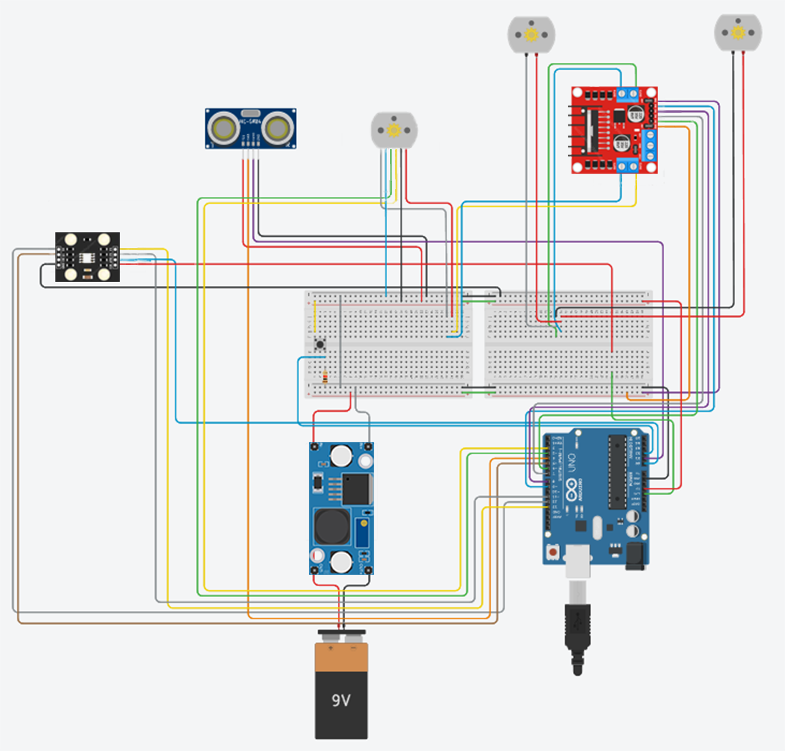

# Dual Color Sorter

An automated conveyor-belt system that classifies objects by color (e.g., orange or blue) and redirects them using a motorized paddle. This educational prototype uses an ultrasonic distance sensor and a color sensor to detect, classify, and sort objects in real time.

## Overview

The Dual Color Sorter is a microcontroller-based prototype that demonstrates the core principles of automated sorting in logistics and manufacturing. It uses basic sensors and actuators controlled by an Arduino Uno to classify and redirect small objects based on color.

## Features

- **Automatic object sorting** based on detected color
- **Color classification** using the TCS230 sensor (default: orange vs. blue)
- **Ultrasonic object detection** with HC-SR04
- **Motorized paddle** for redirection (left for orange, right for blue)
- **Continuous loop logic** with a start/stop button
- **Modular and educational design**, suitable for prototyping and teaching

## Hardware Components

| Component           | Description                                                                 |
|---------------------|-----------------------------------------------------------------------------|
| Arduino Uno         | Main microcontroller                                                        |
| TCS230              | Color sensor for RGB color detection                                        |
| HC-SR04             | Ultrasonic sensor for object presence detection                             |
| GA12-N20 DC Motors  | Drives both the conveyor belt and paddle mechanism                          |
| L298N Motor Driver  | Dual H-bridge to control DC motors                                          |
| LM2596 Buck Converter | Power regulation (6V from 9V battery)                                    |
| Conveyor Belt       | Transports objects through the system                                       |
| Power Supply        | Two 9V batteries                                                            |

##  Project Overview

<p align="center">
  
</p>

<p align="center"><em>Figure : Overview of the Dual Color Sorter system, showing its components and layout.</em></p>

## How It Works

1. The user presses a button to start the conveyor belt.
2. An object is detected by the ultrasonic sensor.
3. The conveyor belt stops once the object reaches the color detection zone.
4. The TCS230 sensor reads the object's color.
5. The Arduino compares the RGB values to reference data:
   - If **orange**, the paddle redirects the object to the left.
   - If **blue**, the paddle redirects it to the right.
6. The belt pauses briefly, then resumes for the next object.

This cycle repeats for continuous sorting.

## Calibration

The color sensor is calibrated in four steps:
1. Place the sensor on a **white** surface and press the button.
2. Repeat for **black**, **blue**, and **orange** surfaces.
3. The system stores RGB thresholds and calculates distances to identify color in real-time.

## Pseudocode Logic

```plaintext
Function setup:
    Initialize pins

Function loop:
    Calculate how long the button was pressed
    if pressed time < 2s:
        if not in calibration mode:
            if system is off:
                Turn on system
            else:
                Turn off system
        else:
            Process calibration step
    else:
        Start calibration mode

    if system is on:
        Start conveyor belt
        Calculate distance to object
        if object reached paddle area:
            Stop conveyor belt
            Detect color
            if color is orange:
                Rotate paddle left
            else if color is blue:
                Rotate paddle right
            else:
                Resume conveyor belt
    else:
        Stop conveyor belt
```

## Technical Specifications

- **Conveyor Dimensions:** 26 × 4 × 4 cm
- **System Dimensions:** 54 × 25 × 24 cm (closed), 75 × 68 × 24 cm (open)
- **Max Object Size:** 3 × 3 × 4 cm
- **Power Supply:** 2 × 9V batteries
- **Operating Temperature:** 10–40°C
- **Estimated Power Consumption:** 35W

## Authors

- **Badea Cătălin-Gabriel** — Hardware design, 3D modeling, wiring, documentation
- **Atudosiei Andrei Cristian** — Firmware development, calibration algorithm, optimization
- **Matei David** — Circuit integration, assembly, component sourcing, video editing